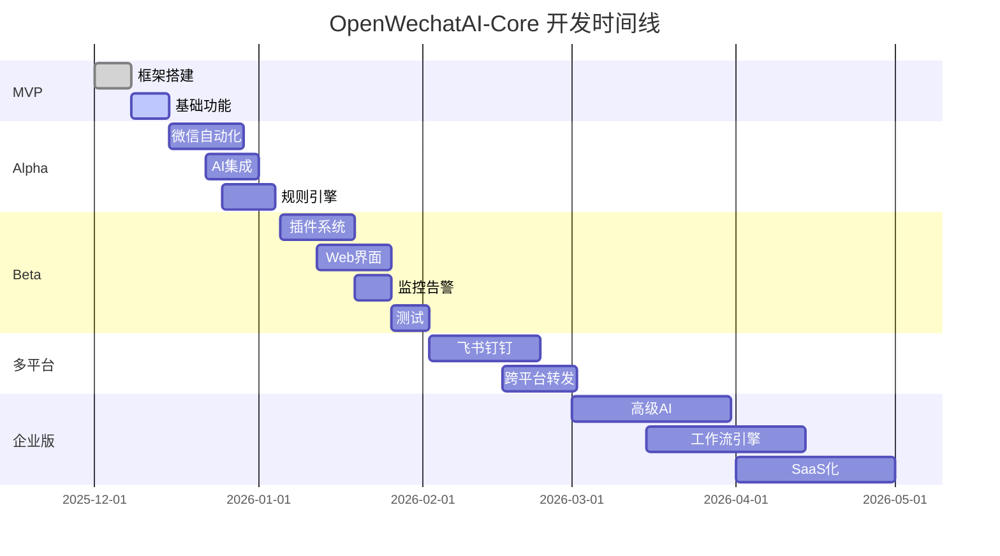

# OpenWechatAI-Core 开发路线图
> 从MVP到生产级产品的完整演进路径

## 📅 版本规划

### v0.1 - MVP (最小可行产品) ✅ 当前阶段
**时间**: 1-2周  
**目标**: 验证核心概念，实现基础功能

#### 功能清单
- [x] 项目框架搭建
- [x] 五层架构设计
- [x] 基础接口定义
- [x] 微信平台接口（伪代码）
- [x] Echo示例技能
- [x] Celery任务队列集成
- [ ] 基础配置系统
- [ ] 简单日志输出

#### 交付物
- 可运行的演示程序
- 基础文档
- 简单的规则配置

---

### v0.5 - Alpha版本 🔄 下一阶段
**时间**: 2-3周  
**目标**: 完善核心功能，实现真实可用

#### 功能清单
- [ ] **完整的微信UI自动化**
  - [ ] 真实的发送消息实现
  - [ ] 获取未读消息
  - [ ] 联系人管理
  - [ ] UI元素定位优化
  
- [ ] **AI集成**
  - [ ] OpenAI GPT集成
  - [ ] 基础对话能力
  - [ ] 上下文管理
  
- [ ] **规则引擎**
  - [ ] YAML规则解析
  - [ ] 规则匹配引擎
  - [ ] 规则优先级
  
- [ ] **数据持久化**
  - [ ] PostgreSQL集成
  - [ ] 消息存储
  - [ ] SQLAlchemy ORM
  
- [ ] **日志系统**
  - [ ] Loguru配置
  - [ ] 结构化日志
  - [ ] 日志轮转

#### 交付物
- 能自动回复微信消息的机器人
- 可配置的规则文件
- 完整的安装文档

---

### v1.0 - Beta版本 ⏳ 计划中
**时间**: 3-4周  
**目标**: 生产就绪，稳定可靠

#### 功能清单
- [ ] **插件系统**
  - [ ] 插件管理器
  - [ ] 动态加载机制
  - [ ] 插件生命周期
  
- [ ] **高级技能**
  - [ ] AI智能对话技能
  - [ ] 图片识别技能
  - [ ] 定时任务技能
  - [ ] 数据查询技能
  
- [ ] **Web管理界面**
  - [ ] FastAPI后端
  - [ ] 消息历史查询
  - [ ] 规则在线编辑
  - [ ] 插件管理
  - [ ] 实时监控
  
- [ ] **监控告警**
  - [ ] Prometheus指标
  - [ ] Grafana仪表板
  - [ ] Sentry错误追踪
  - [ ] 邮件/短信告警
  
- [ ] **安全加固**
  - [ ] API认证授权
  - [ ] 敏感信息加密
  - [ ] 速率限制
  
- [ ] **测试覆盖**
  - [ ] 单元测试 > 70%
  - [ ] 集成测试
  - [ ] E2E测试

#### 交付物
- 生产级应用
- 完整的Web管理平台
- 运维文档
- API文档

---

### v1.5 - 多平台支持 🎯 未来
**时间**: 4-6周  
**目标**: 扩展到其他消息平台

#### 功能清单
- [ ] **飞书集成**
  - [ ] 飞书机器人API
  - [ ] 消息收发
  - [ ] 群组管理
  
- [ ] **钉钉集成**
  - [ ] 钉钉机器人API
  - [ ] 消息推送
  - [ ] 审批集成
  
- [ ] **企业微信集成**
  - [ ] 企业微信API
  - [ ] 通讯录同步
  - [ ] 应用消息
  
- [ ] **跨平台消息转发**
  - [ ] 平台间消息同步
  - [ ] 格式转换
  - [ ] 附件处理
  
- [ ] **多设备管理**
  - [ ] 设备池管理
  - [ ] 负载均衡
  - [ ] 故障转移

#### 交付物
- 支持5+平台的智能机器人
- 跨平台消息中台
- 平台对接文档

---

### v2.0 - 企业版 🚀 长期
**时间**: 2-3个月  
**目标**: 企业级功能，商业化准备

#### 功能清单
- [ ] **高级AI能力**
  - [ ] 多模型支持（GPT-4, Claude, Gemini）
  - [ ] RAG知识库
  - [ ] 多模态理解（图片、语音）
  - [ ] AI Agent编排
  
- [ ] **工作流引擎**
  - [ ] 可视化流程设计
  - [ ] 复杂业务流程
  - [ ] 审批流程
  - [ ] 定时任务调度
  
- [ ] **数据分析**
  - [ ] 消息统计分析
  - [ ] 用户行为分析
  - [ ] 趋势预测
  - [ ] 自定义报表
  
- [ ] **权限管理**
  - [ ] 多租户支持
  - [ ] RBAC权限模型
  - [ ] 审计日志
  
- [ ] **高可用架构**
  - [ ] 微服务拆分
  - [ ] 服务网格
  - [ ] 分布式追踪
  - [ ] 灰度发布
  
- [ ] **SaaS化**
  - [ ] 订阅计费
  - [ ] 配额管理
  - [ ] 多语言支持
  - [ ] 白标定制

#### 交付物
- 企业级SaaS平台
- 商业许可
- 企业支持服务

---

## 🎯 里程碑



---

## 📊 功能优先级矩阵

| 功能模块 | 重要性 | 紧急性 | 难度 | 版本 | 状态 |
|---------|--------|--------|------|------|------|
| 微信UI自动化 | ⭐⭐⭐⭐⭐ | 🔴 高 | 中 | v0.5 | 进行中 |
| AI集成 | ⭐⭐⭐⭐⭐ | 🔴 高 | 低 | v0.5 | 计划中 |
| 规则引擎 | ⭐⭐⭐⭐ | 🔴 高 | 中 | v0.5 | 计划中 |
| 数据库存储 | ⭐⭐⭐⭐ | 🔴 高 | 低 | v0.5 | 计划中 |
| 插件系统 | ⭐⭐⭐⭐⭐ | 🟡 中 | 高 | v1.0 | 未开始 |
| Web管理界面 | ⭐⭐⭐⭐ | 🟡 中 | 中 | v1.0 | 未开始 |
| 监控告警 | ⭐⭐⭐⭐ | 🟡 中 | 低 | v1.0 | 未开始 |
| 飞书集成 | ⭐⭐⭐ | 🟢 低 | 低 | v1.5 | 未开始 |
| 钉钉集成 | ⭐⭐⭐ | 🟢 低 | 低 | v1.5 | 未开始 |
| 多模态AI | ⭐⭐⭐⭐⭐ | 🟢 低 | 高 | v2.0 | 未开始 |
| RAG知识库 | ⭐⭐⭐⭐ | 🟢 低 | 高 | v2.0 | 未开始 |
| 工作流引擎 | ⭐⭐⭐⭐ | 🟢 低 | 高 | v2.0 | 未开始 |

---

## 🔄 迭代策略

### 敏捷开发
- **Sprint周期**: 2周
- **发布周期**: 每月一次小版本
- **代码评审**: 所有PR必须评审
- **自动化测试**: CI/CD流水线

### 质量标准
- 单元测试覆盖率 > 80%
- 代码审查通过率 100%
- 性能基准满足要求
- 无高危安全漏洞

### 反馈循环
```
计划 → 开发 → 测试 → 部署 → 监控 → 反馈 → 计划
  ↑                                        ↓
  └────────────────────────────────────────┘
```

---

## 📈 成功指标

### 技术指标
- [ ] 系统可用性 > 99.9%
- [ ] 消息处理延迟 < 1s
- [ ] API响应时间 < 200ms
- [ ] 支持平台数量 >= 5
- [ ] 插件生态 >= 20

### 业务指标
- [ ] 活跃设备数 > 100
- [ ] 日消息处理量 > 10万
- [ ] 用户满意度 > 4.5/5
- [ ] Bug修复时间 < 24h
- [ ] 新功能上线周期 < 2周

---

## 🎓 技术债务管理

### 当前技术债
1. 微信UI自动化仅有伪代码
2. 缺少完整的异常处理
3. 测试覆盖率不足
4. 文档不完整

### 偿还计划
- **v0.5**: 偿还核心功能技术债
- **v1.0**: 完善测试和文档
- **v1.5**: 架构优化重构
- **v2.0**: 性能优化调优

---

## 🤝 贡献指南

### 如何参与
1. Fork项目
2. 创建功能分支
3. 提交代码（遵循规范）
4. 创建Pull Request
5. 代码评审
6. 合并主分支

### 分支策略
```
main (生产)
  ↑
develop (开发)
  ↑
feature/* (功能)
hotfix/* (热修复)
release/* (发布)
```

---

## 📞 联系方式

- **项目主页**: https://github.com/tianh-ai/OpenWechatAI-Core
- **问题反馈**: GitHub Issues
- **讨论区**: GitHub Discussions
- **邮件**: openwechatai@example.com

---

**路线图版本**: v1.0  
**最后更新**: 2025-12-16  
**下次审查**: 2026-01-16
